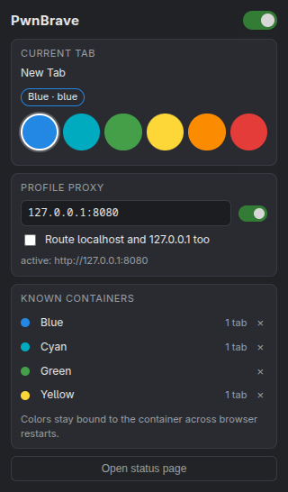
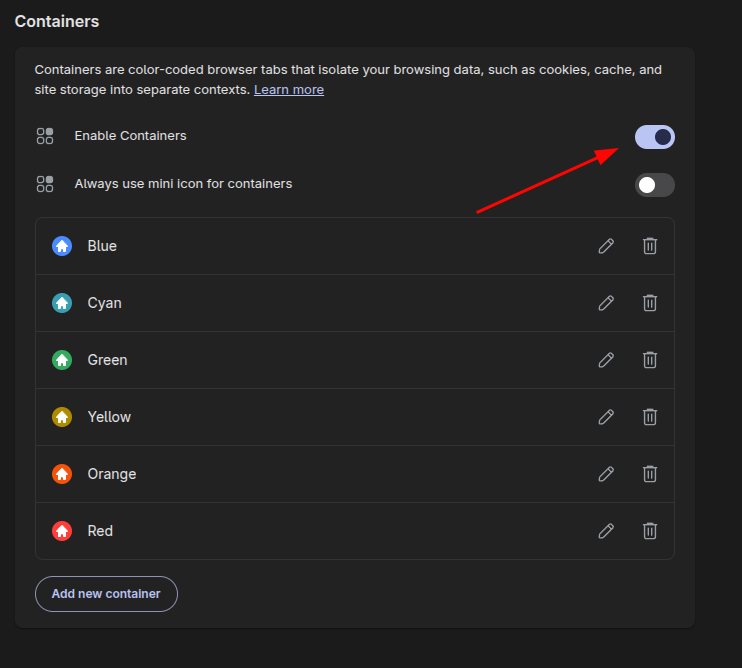
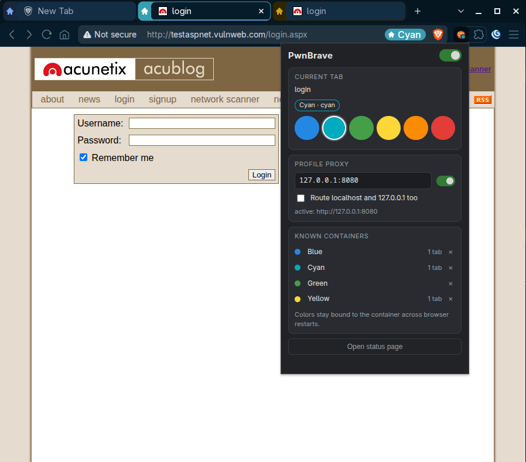

#  PwnBrave

I've been a Firefox user for a long time, and for web testing
[PwnFox](https://github.com/yeswehack/PwnFox) was one of the things I couldn't
live without. But I'm also a Brave user, and now that Brave supports containers
natively, I wanted the same workflow there, so I built this extension with the
help of AI. (Yes, better to be clear in the first place, let him who is without sin cast the first stone)

PwnBrave gives every Brave container its own color, so Burp highlights their requests per identity, and
traffic outside containers is never tagged. It also drives the profile proxy.

It works with the existing PwnFox Burp extension as is: the colors are Burp
highlight names, and the Burp side strips the header before forwarding the request.

## Limitations and considerations for Pwnfox users

1. Containers cannot be created automatically when installing. Create them by hand in
   `brave://settings/braveContent`, then map each one to a color from the popup.
   The mapping is saved permanently, so it's a one-time job.
2. Chromium-based browsers can't route only container traffic through a proxy:
   once the proxy is on, all traffic goes through it. That's why I recommend a
   dedicated testing profile. Normal tabs are not tagged, so Burp doesn't
   highlight them.
3. I kept only 6 of PwnFox's 8 colors, the ones that best match the colors
   Brave offers for containers.
4. I left out PwnFox's other features, such as the postMessage logger, since
   dedicated extensions like [FancyTracker](https://github.com/Zeetaz/FancyTracker)
   can better handle them now.
5. Brave doesn't expose containers to extensions, so PwnBrave recognises them
   indirectly and can't read their names: the names in the popup are your own
   labels.

## Install

1. Enable Containers in `brave://settings/braveContent` and create one container
   for each identity you need.

   

2. Download `pwnbrave-<version>.zip` from the
   [latest release](https://github.com/leorac/pwnbrave/releases/latest) and
   extract it somewhere it can stay.
3. Open `brave://extensions` and turn on Developer mode.
4. Click Load unpacked and pick the extracted `pwnbrave` folder.

Tabs that are already open get picked up automatically.

## Use

1. Open the target in a tab and move it into a container (right click the tab,
   Open in container).
2. Load a URL in the container tab. PwnBrave can only recognise the container
   once a web page has loaded: on the new tab page or on `brave://` pages the
   color won't show up.
3. The container shows up in the popup with the first free color, already applied.
4. Change the color or rename the container from the popup if you like. The
   choice sticks to the container, even across browser restarts.
5. In Burp, with the PwnFox extension loaded, requests arrive already highlighted.

### Colors

`blue`, `cyan`, `green`, `yellow`, `orange`, `red`. New containers get the first
free one, and after six it starts over.

Over HTTP/2 header names are lowercase by spec, so in Burp's history it shows up
as `x-pwnfox-color`: search case-insensitively.

### Proxy

Type Burp's proxy listener address (by default `127.0.0.1:8080`) and flip the switch.

### Claude in Chrome

Claude in Chrome can't open a tab inside a container, but it can drive one you
opened yourself: just drag the container tab into Claude's tab group. The tab
keeps its container and every request stays tagged.

## License

[MIT](LICENSE)
